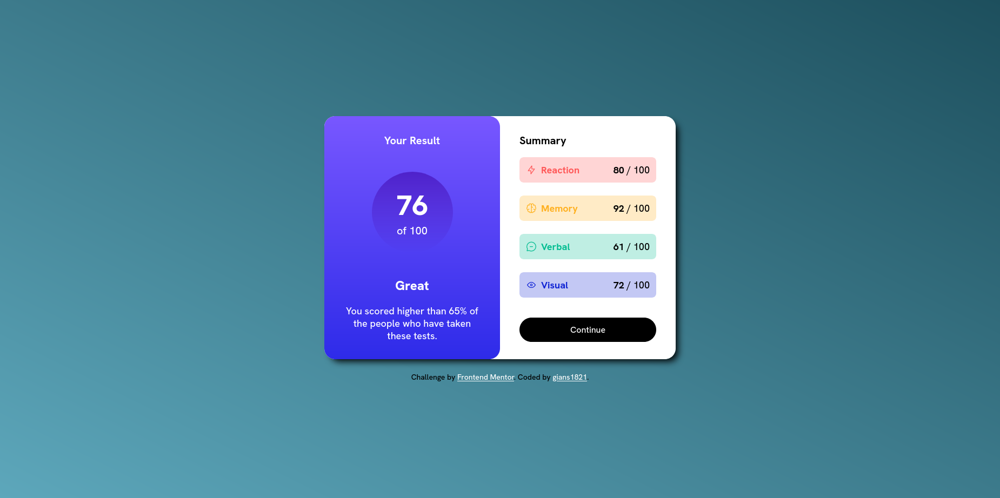
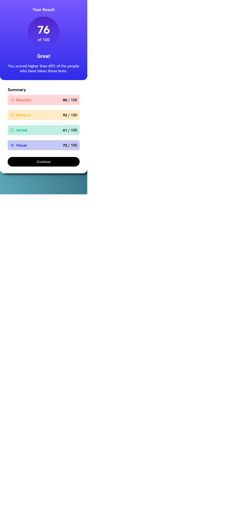

# Frontend Mentor - Results summary component solution

This is a solution to the [Results summary component challenge on Frontend Mentor](https://www.frontendmentor.io/challenges/results-summary-component-CE_K6s0maV). Frontend Mentor challenges help you improve your coding skills by building realistic projects. 

## Table of contents

- [Overview](#overview)
  - [The challenge](#the-challenge)
  - [Screenshot](#screenshot)
  - [Links](#links)
- [My process](#my-process)
  - [Built with](#built-with)
  - [What I learned](#what-i-learned)
  - [Continued development](#continued-development)

## Overview

### The challenge

Users should be able to:

- View the optimal layout for the interface depending on their device's screen size
- See hover and focus states for all interactive elements on the page
- **Bonus**: Use the local JSON data to dynamically populate the content

### Screenshot

Desktop Preview
---

Mobile Preview
---

### Links

- Solution URL: [My solution](https://www.frontendmentor.io/solutions/results-summary-using-html-css-and-js-lk4YRrqQBs)
- Live Site URL: [My live site](https://gians1821.github.io/results-summary-component/index.html)

## My process

### Built with

- Semantic HTML5 markup
- CSS custom properties
- Flexbox
- Basic JavaScript

### What I learned

- I learned to create HTML elements with JS.
- I learned to organize my stylesheet

### Continued development

- I will try to manipulate data with JSON. 
- I will go deep on CSS Flexbox and CSS Grid
- I will learn React or Astro
